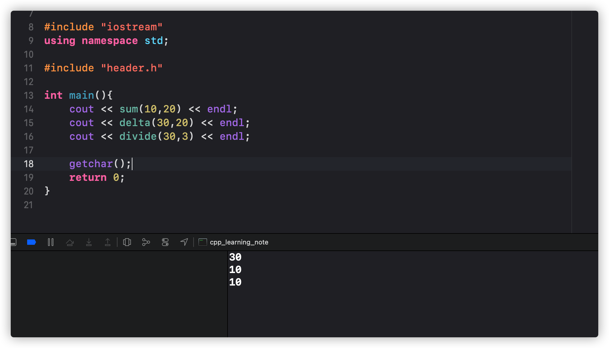

# C++ "extern c"
## 什么是`extern`
`extern`是`C/C++`语言中表明函数和全局变量作用范围的关键字，该关键字会告诉编译器，其声明的函数和变量在本模块或其他模块使用
`extern`经常会在`C/C++`混合开发中出现，因为我们使用的很多第三方开源库很多都是`C`写的，那么我们在`C++`中想使用它，直接引用就可以了
## 如何实现
头部代码如下：
```c++
// header.h
extern "C" {
    int sum(int v1 , int v2);
    int delta(int v1 , int v2);
    int divide(int v1 , int v2);
}
```
我们在这里分别定义了三个函数，加法、减法、除法
然后我们看实现方法:
```c
// func.c
int sum(int v1, int v2){
    return  v1 + v2;
}

int delta(int v1 ,int v2){
    return v1 - v2;
}

int divide(int v1, int v2){
    return v1 / v2;
}
```
实现功能很简单，没啥可说的
调用如下:
```c++
// main.cpp
#include "func.h"

int main(){
    cout << sum(10,20) << endl;
    cout << delta(30,20) << endl;
    cout << divide(30,3) << endl;

    getchar();
    return 0;
}
```
程序运行，返回如下

这个程序没啥难度，主要是将加法，减法，除法以C扩展形式让C++调用
## 引用链接
https://zhuanlan.zhihu.com/p/123269132
http://c.biancheng.net/view/404.html
