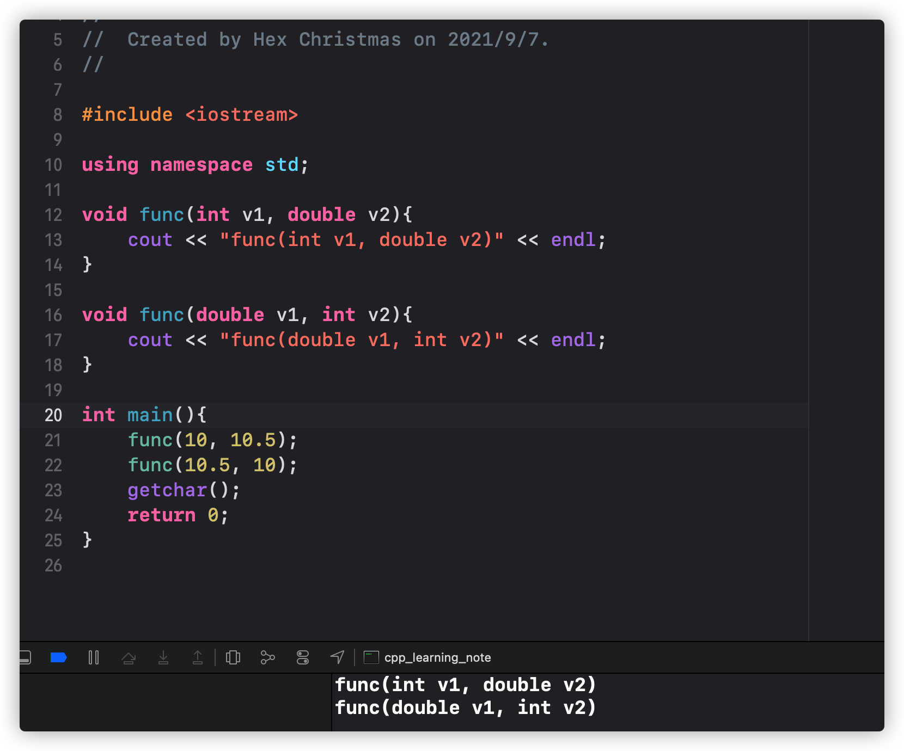
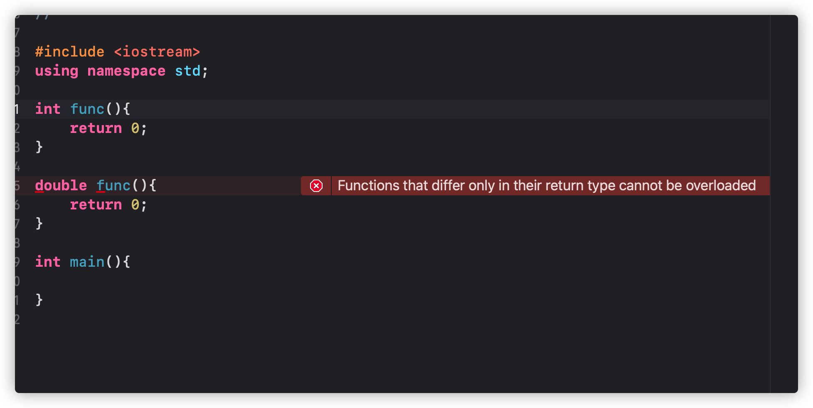
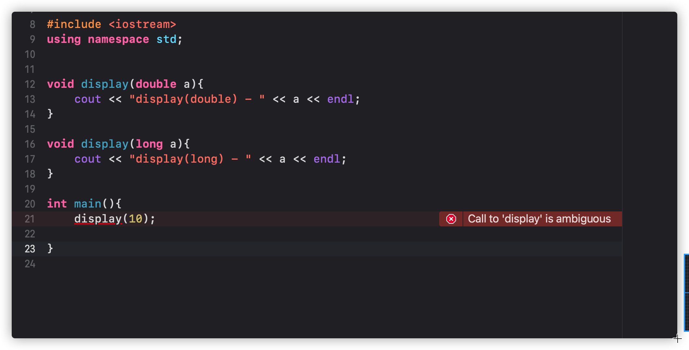

# C++函数重载
## 啥叫重载
重载(overload)，同一个标识符在不同的上下文有不同的意义
## 函数重载在C++中怎么理解
函数重载(function overload)，即用一个函数名定义不同的函数，采用了name mangling技术(C++编译器会对符号名(函数名)进行改编修饰)，当函数名和不同的参数搭配时函数的含义不同
## 如何构成函数重载
需要至少满足以下其中一个条件:
* 参数个数不同
* 参数类型不同
* 参数顺序不同

比如下边这个程序
```c++
int sum(int v1, int v2){
    return v1+ v2;
}

int sum(int v1, int v2, int v3){
    return v1 + v2 + v3;
}

int main(){
    cout << sum(10,20) << endl;
    cout << sum(10,20,30) << endl;
    getchar();
    return 0;
}
```

同样的函数名`sum`，一个参数是`v1`和`v2`，另一个参数是`v1`，`v2`和`v3`，然后把我们传进来的参数做加法，然后我们把`10`,`20`和`30`传进去，程序打印出来的是`30`和`60`，这个就是函数名相同，参数个数不同构成的`函数重载`
再来看一个例子
```c++
void func(int v1, double v2){
    cout << "func(int v1, double v2)" << endl;
}

void func(double v1, int v2){
    cout << "func(double v1, int v2)" << endl;
}

int main(){
    func(10, 10.5);
    func(10.5, 10);
    getchar();
    return 0;
}
```

这里边，我们定义一个函数`func`，然后传进去一个`int`类型的`v1`，一个`double`类型的`v2`，然后我们在定义一个`func`，然后传入一个`double`类型的`v1`，一个`int`类型的`v2`，然后给`v1`，`v2`传入`10`,`10.5`，然后我们看到程序返回了
```c++
func(int v1, double v2)
func(double v1, int v2)
```
这个例子就是函数名相同，但是参数的类型以及顺序不同构成的函数重载
我们在看一个例子

这里我们看到，编译器直接给我们报错了，说返回类型不同的函数不能重载

还有一个重要的点就是，调用函数时，实参的隐式类型转换可能会产生二义性，我们再来看一个例子,构造如下的一段程序
```c++
void display(double a){
    cout << "display(double) - " << a << endl;
}

void display(long a){
    cout << "display(long) - " << a << endl;
}

int main(){
    display(10);

}
```
定义一个`display`，然后传入一个`double`类型的`a`，然后在定义一个`display`，然后传入一个`long`类型的`a`，然后我们跑起来

我们发现程序报错了，说程序对`display`函数的调用不明确，因为你传入的是个`int`类型，程序会通过隐性转换把你传入的`a`，转换成`double`类型也可以，转换成`long`类型也可以，存在二义性，所以就会报错说函数调用不明确
