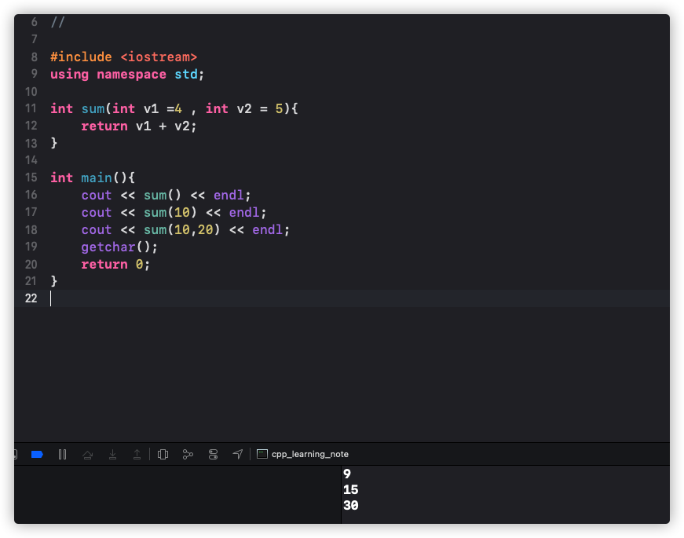
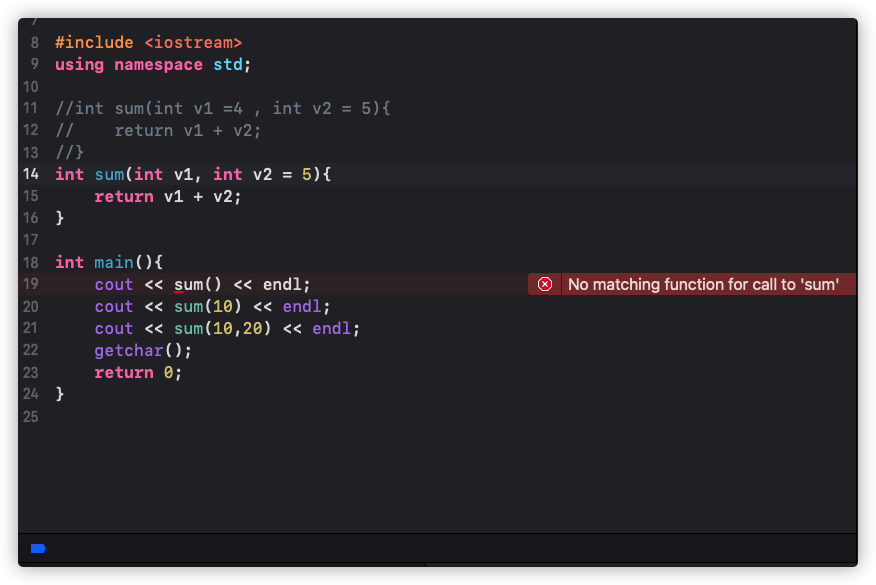
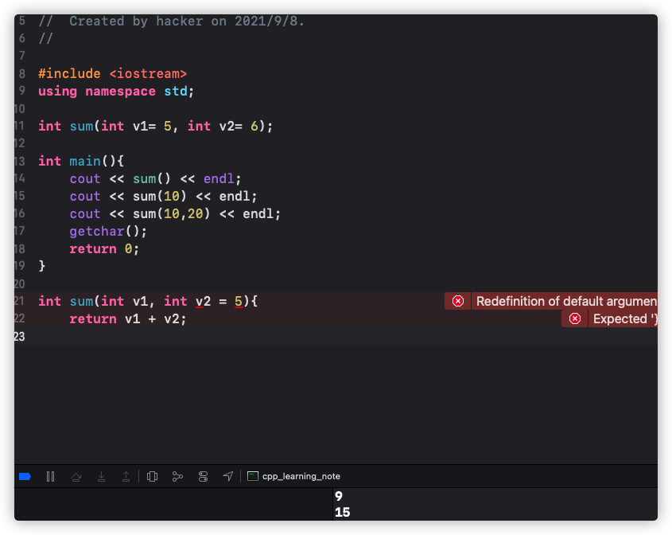
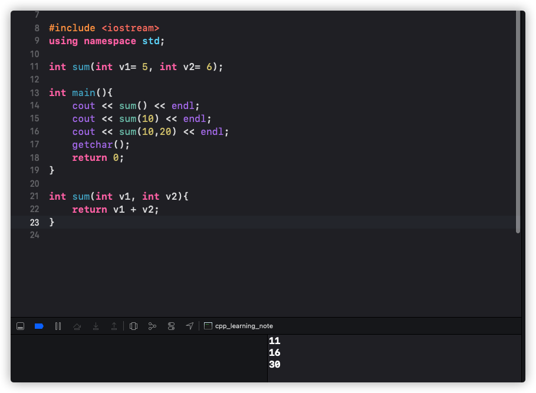

# C++默认参数
## 默认参数是咋回事
函数可以为形参分配默认参数，当函数调用遗漏实际参数时，默认参数将传递给形参
### 关于形参，实参
形参，实参出现在C语言中用于传递数据，函数参数会出现在函数定义处和函数调用处，所以就会出现形参和实参，调用的时候实参的值会传给形参
> 形参(形式参数)，当参数出现在函数定义中，可以把它当成一个占位符，它没有数据，当被其他函数调用才会有数据，其他函数会把数据传递给它

>实参(实际参数)，函数被调用时给出的参数具有真实的数据，且会被代码使用

## C++代码实现
我们写了一段这样的程序
```c++
int sum(int v1 =4 , int v2 = 5){
    return v1 + v2;
}

int main(){
    cout << sum() << endl;
    cout << sum(10) << endl;
    cout << sum(10,20) << endl;
    getchar();
    return 0;
}
```
这里边给`v1`定义一个默认形参`4`，给`v2`定义一个默认的形参`5`，然后让它做加法，我们将程序跑起来

我们这里看到，`sum()`返回的是`9`，因为我们给`v1`和`v2`分别设置了默认的值，所以直接就打印处`9`，`sum(10)`返回的是`15`，因为默认参数是从右边传入的，所以实参会传递给形参，所以就是`10+5`返回的是`15`，`sum(10,20)`同理
## 关于默认参数注意的点
我们上边提到，默认参数值必须从右边传入，我们来看一个例子，还是刚刚的程序，我们稍微改一下子
```c++
int sum(int v1, int v2 = 5){
    return v1 + v2;
}

int main(){
    cout << sum() << endl;
    cout << sum(10) << endl;
    cout << sum(10,20) << endl;
    getchar();
    return 0;
}
```
程序跑起来

这里我们看到，报错了，说缺少默认的`v2`参数，对于`cout << sum() << endl;`这行，`v2`没有问题，他有默认的参数，但是`v1`是没有值的，所以默认参数只能从右往左传

函数如果同时有声明、实现，默认参数只能放在函数声明中，我们来看一个例子，这样一段程序
```c++
int sum(int v1= 5, int v2= 6);

int main(){
    cout << sum() << endl;
    cout << sum(10) << endl;
    cout << sum(10,20) << endl;
    getchar();
    return 0;
}

int sum(int v1, int v2 = 5){
    return v1 + v2;
}
```
这段程序中，我们把函数参数值提前进行了声明，我们运行

我们看到报了一个错，说`Redefinition of default argument`重新定义默认参数，因为我们在声明里定义了一遍，在函数里又定义了一遍，所以会报错，我们把函数里的定义去掉,跑起来

发现没有报错
